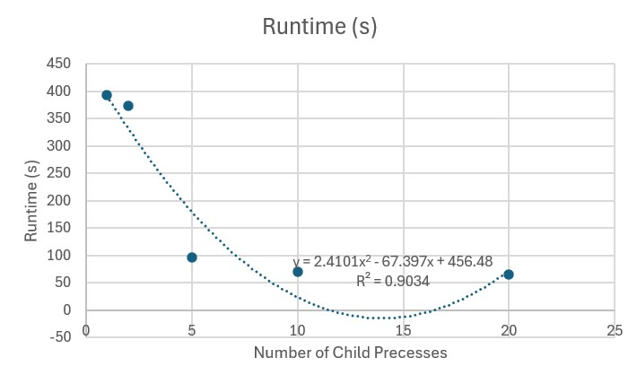

# System Programming Lab 11 Multiprocessing
Program that invokes mandel 50 times and varies the scaling in an exponential fashion to allow for a 
smooth 50 frame .mpg video to be made. To specify number of processes, use -n and then the number of
processes wanting to use. By default, it does 1 process. When splitting up the frames that each child 
process makes, I divide the 50 frames by total number of child processes. All remaining go into the
first child processes that do not divide evenly. So, if there are 10 extras, then those 10 extras
go into the first 10 respectively. It saves each file as frame_%03d.jpg.

## Graph of Runtime Results

## Discussion of Results
As I had more and more processes, the runtime was shorter and shorter. It followed an n^2 correlation
the best out of every correlation. This makes sense because forking is n^2. Also, the numbers divisible
by 50 for child processes worked the best and had the most significant differences in runtime.